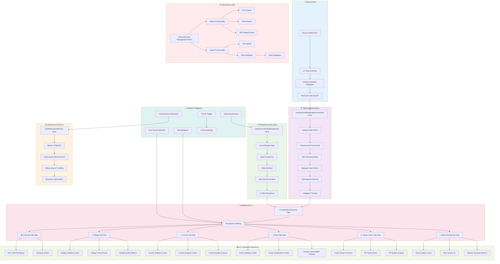

# Diagram Alur Sistem Pemantauan Listrik

Halaman ini menyediakan diagram alur dan ilustrasi yang mendetail mengenai arsitektur serta alur data dari Sistem Pemantauan Listrik yang dikembangkan untuk memantau parameter listrik 3 fase menggunakan sensor PZEM.

<Note>
Sistem ini dirancang khusus untuk memantau tegangan, arus, daya, dan faktor daya pada instalasi listrik 3 fase dengan visualisasi real-time dan analisis kualitas daya.
</Note>

## Diagram Alur Keseluruhan

Diagram berikut menunjukkan alur kerja lengkap dari sistem pemantauan listrik, mulai dari akses pengguna hingga visualisasi data:

```mermaid
flowchart TD
    A[Akses Pengguna] --> B{Autentikasi}
    B -->|Terautentikasi| C[Pemuatan Dasbor]
    B -->|Tidak Terautentikasi| D[Halaman Masuk]
    D --> B
    
    C --> E[Komponen Tajuk]
    E --> E1[Tampilan Logo]
    E --> E2[Status Koneksi Firebase]
    E --> E3[Tampilan Waktu Real-time]
    E --> E4[Tombol Tema Gelap/Terang]
    
    C --> F[Navigasi Tab Utama]
    F --> F1[Tab Ikhtisar - KPI Utama]
    F --> F2[Tab Analisis Tegangan]
    F --> F3[Tab Analisis Arus]
    F --> F4[Tab Analisis Daya]
    F --> F5[Tab Faktor Daya]
    F --> F6[Tab Pemantauan Perangkat]
    F --> F7[Tab Manajemen Data]
    
    C --> G[Lapisan Manajemen Data]
    G --> G1[Hook Data Real-time Firebase]
    G1 --> G11[Koneksi Firebase Realtime]
    G1 --> G12[Pemrosesan Data PZEM]
    G1 --> G13[Manajemen Cache Cerdas]
    
    G --> G2[Sistem Penyaringan Data]
    G2 --> G21[Filter Rentang Waktu 24J/7H/1B]
    G2 --> G22[Penyaringan Parameter Listrik]
    G2 --> G23[Agregasi Data Historis]
    
    G --> G3[Pemantauan Kinerja Sistem]
    G3 --> G31[Pengumpulan Metrik Performa]
    G3 --> G32[Optimalisasi Memory & CPU]
    
    F1 --> H1[Kartu KPI Utama]
    H1 --> H11[Kartu Tegangan Rata-rata]
    H1 --> H12[Kartu Arus Rata-rata]
    H1 --> H13[Kartu Daya Aktif Total]
    H1 --> H14[Kartu Faktor Daya Rata-rata]
    
    F1 --> H2[Grafik Ikhtisar]
    H2 --> H21[Grafik Tegangan 3 Fase]
    H2 --> H22[Grafik Daya Komposit]
    
    F2 --> I1[Statistik Tegangan per Fase]
    I1 --> I11[Kartu Tegangan Fase R]
    I1 --> I12[Kartu Tegangan Fase S]
    I1 --> I13[Kartu Tegangan Fase T]
    
    F2 --> I2[Analisis Kualitas Tegangan]
    I2 --> I21[Grafik Trend Tegangan]
    I2 --> I22[Analisis Ketidakseimbangan]
    
    F2 --> I3[Metrik Kualitas Tegangan]
    I3 --> I31[THD Tegangan per Fase]
    I3 --> I32[Stabilitas Frekuensi]
    I3 --> I33[Regulasi Tegangan]
    I3 --> I34[Analisis Flicker]
    
    F3 --> J1[Statistik Arus per Fase]
    J1 --> J11[Arus Fase R-N]
    J1 --> J12[Arus Fase S-N]
    J1 --> J13[Arus Fase T-N]
    
    F3 --> J2[Visualisasi Arus]
    J2 --> J21[Grafik Area Arus 3 Fase]
    J2 --> J22[Grafik Analisis THD Arus]
    
    F3 --> J3[Analisis Kualitas Arus]
    J3 --> J31[THD Arus per Fase]
    J3 --> J32[Ketidakseimbangan Arus]
    J3 --> J33[Faktor Puncak (Crest Factor)]
    J3 --> J34[Faktor Beban (Load Factor)]
    
    F4 --> K1[Statistik Daya Listrik]
    K1 --> K11[Daya Aktif (kW)]
    K1 --> K12[Daya Reaktif (kVAR)]
    K1 --> K13[Daya Semu (kVA)]
    
    F4 --> K2[Visualisasi Daya]
    K2 --> K21[Grafik Trend Daya]
    K2 --> K22[Diagram Segitiga Daya]
    
    F4 --> K3[Analisis Konsumsi Energi]
    K3 --> K31[Konsumsi Harian (kWh)]
    K3 --> K32[Analisis Biaya Listrik]
    K3 --> K33[Estimasi Emisi CO2]
    K3 --> K34[Informasi Tarif PLN]
    
    F5 --> L1[Ikhtisar Faktor Daya]
    L1 --> L11[Faktor Daya Saat Ini]
    L1 --> L12[Faktor Daya Rata-rata]
    L1 --> L13[Sudut Fase (φ)]
    L1 --> L14[Kompensasi Kapasitor]
    
    F5 --> L2[Analisis Faktor Daya]
    L2 --> L21[Grafik Trend Faktor Daya]
    L2 --> L22[Analisis Kebutuhan Kompensasi]
    
    F5 --> L3[Klasifikasi Kualitas]
    L3 --> L31[Kategori Faktor Daya]
    L3 --> L32[Dampak Ekonomi]
    
    F6 --> M1[Pemantauan Perangkat PZEM]
    M1 --> M11[Status Perangkat PZEM-004T]
    M1 --> M12[Parameter Listrik Real-time]
    M1 --> M13[Persentase Beban]
    M1 --> M14[Efisiensi Perangkat]
    M1 --> M15[Indikator Kualitas Daya]
    
    F6 --> M2[Sistem Peringatan]
    M2 --> M21[Alert Anomali Parameter]
    M2 --> M22[Notifikasi Gangguan]
    
    F6 --> M3[Metrik Ringkasan Sistem]
    M3 --> M31[Jumlah Perangkat Normal]
    M3 --> M32[Beban Sistem Rata-rata]
    M3 --> M33[Efisiensi Keseluruhan]
    
    F7 --> N1[Panel Manajemen Data]
    N1 --> N11[Ekspor Data CSV/JSON/PDF]
    N1 --> N12[Import Data Historis]
    N1 --> N13[Filter Data Lanjutan]
    N1 --> N14[Manajemen Cache]
    
    G11 --> O[Firebase Realtime Database]
    O --> O1[Data Sensor PZEM Real-time]
    O --> O2[Data Historis Terkompresi]
    
    G21 --> P[Penyimpanan Browser]
    P --> P1[Cache Pengukuran]
    P --> P2[Preferensi Pengguna]
    P --> P3[Data Offline]
    
    style A fill:#e1f5fe
    style B fill:#f3e5f5
    style C fill:#e8f5e8
    style F fill:#fff3e0
    style G fill:#fce4ec
    style O fill:#f1f8e9
    style P fill:#e0f2f1
    
    classDef antarmukaPengguna fill:#e1f5fe,stroke:#01579b;
    classDef autentikasi fill:#f3e5f5,stroke:#4a148c;
    classDef dasbor fill:#e8f5e8,stroke:#1b5e20;
    classDef navigasi fill:#fff3e0,stroke:#e65100;
    classDef lapisanData fill:#fce4ec,stroke:#880e4f;
    classDef basisData fill:#f1f8e9,stroke:#33691e;
    classDef penyimpanan fill:#e0f2f1,stroke:#004d40;
```

## Arsitektur Sistem Berlapis

Sistem pemantauan listrik menggunakan arsitektur berlapis yang terstruktur untuk memastikan skalabilitas dan maintainability:

```mermaid
flowchart TD
    subgraph Lapisan_UI["🖥️ Lapisan Antarmuka Pengguna"]
        A[Akses Pengguna] --> B{Autentikasi}
        B -->|✅ Terautentikasi| C[Dasbor Next.js 14]
        B -->|❌ Tidak Terautentikasi| D[Halaman Login]
        D --> B
        
        C --> E[Header Sistem]
        E --> E1[Logo & Branding]
        E --> E2[Status Koneksi Real-time]
        E --> E3[Timestamp Sinkronisasi]
        E --> E4[Toggle Dark/Light Mode]
        
        C --> F[Navigasi Tab Responsif]
        F --> F1[📊 Tab Ikhtisar]
        F --> F2[⚡ Tab Tegangan]
        F --> F3[🔌 Tab Arus]
        F --> F4[💡 Tab Daya]
        F --> F5[📈 Tab Faktor Daya]
        F --> F6[🔧 Tab Perangkat]
        F --> F7[💾 Tab Data Management]
    end
    
    subgraph Lapisan_Data["🔄 Lapisan Pemrosesan Data"]
        C --> G[Pipeline Data Terpadu]
        
        G --> G1[Hook Real-time Firebase]
        G1 --> G11[Service Layer Firebase]
        G1 --> G12[Transformasi Data PZEM]
        G1 --> G13[Intelligent Caching]
        
        G --> G2[Enhanced Data Manager]
        G2 --> G21[Local Storage Manager]
        G2 --> G22[Filter Engine]
        G2 --> G23[Data Aggregation Service]
        
        G --> G3[Performance Monitor]
        G3 --> G31[Metrics Collection]
        G3 --> G32[Resource Optimization]
        
        G11 --> H[Firebase Realtime DB]
        G21 --> I[Browser Storage]
    end
    
    subgraph Komponen_Visual["🎨 Komponen Visualisasi"]
        F1 --> J1[Sistem KPI Cards]
        J1 --> J11[📊 Voltage KPI]
        J1 --> J12[⚡ Current KPI]
        J1 --> J13[💡 Power KPI]
        J1 --> J14[📈 PF KPI]
        
        F1 --> J2[Charts Overview]
        J2 --> J21[Line Chart Tegangan 3-Fase]
        J2 --> J22[Composed Chart Daya]
        
        F2 --> K1[Voltage Statistics]
        K1 --> K11[Phase R Voltage Card]
        K1 --> K12[Phase S Voltage Card]
        K1 --> K13[Phase T Voltage Card]
        
        F2 --> K2[Voltage Analysis Charts]
        K2 --> K21[Enhanced Voltage Trend]
        K2 --> K22[Voltage Imbalance Analysis]
        
        F2 --> K3[Voltage Quality Metrics]
        K3 --> K31[THD Voltage Analysis]
        K3 --> K32[Frequency Stability]
        K3 --> K33[Voltage Regulation]
        K3 --> K34[Flicker Analysis]
        
        F3 --> L1[Current Statistics]
        L1 --> L11[Phase R Current]
        L1 --> L12[Phase S Current]
        L1 --> L13[Phase T Current]
        
        F3 --> L2[Current Analysis Charts]
        L2 --> L21[3-Phase Current Area Chart]
        L2 --> L22[THD Current Analysis]
        
        F3 --> L3[Current Quality Analysis]
        L3 --> L31[Current THD per Phase]
        L3 --> L32[Current Imbalance]
        L3 --> L33[Crest Factor Analysis]
        L3 --> L34[Load Factor Calculation]
        
        F4 --> M1[Power Statistics]
        M1 --> M11[Active Power (kW)]
        M1 --> M12[Reactive Power (kVAR)]
        M1 --> M13[Apparent Power (kVA)]
        
        F4 --> M2[Power Visualization]
        M2 --> M21[Power Trend Charts]
        M2 --> M22[Power Triangle Diagram]
        
        F4 --> M3[Energy Consumption]
        M3 --> M31[Daily Consumption (kWh)]
        M3 --> M32[Cost Analysis]
        M3 --> M33[CO2 Emission Estimate]
        M3 --> M34[PLN Tariff Information]
        
        F5 --> N1[Power Factor Overview]
        N1 --> N11[Current Power Factor]
        N1 --> N12[Average Power Factor]
        N1 --> N13[Phase Angle (φ)]
        N1 --> N14[Capacitor Compensation]
        
        F5 --> N2[PF Analysis Charts]
        N2 --> N21[Power Factor Trend]
        N2 --> N22[Compensation Analysis]
        
        F5 --> N3[PF Quality Classification]
        N3 --> N31[PF Category Assessment]
        N3 --> N32[Economic Impact Analysis]
        
        F6 --> O1[Device Monitoring]
        O1 --> O11[PZEM Device Cards]
        O1 --> O12[Device Status Indicators]
        O1 --> O13[Real-time Parameters]
        O1 --> O14[Load Percentage]
        O1 --> O15[Power Quality Indicators]
        
        F6 --> O2[Alert System]
        O2 --> O21[Parameter Anomaly Alerts]
        O2 --> O22[System Fault Notifications]
        
        F6 --> O3[System Summary Metrics]
        O3 --> O31[Normal Device Count]
        O3 --> O32[Average System Load]
        O3 --> O33[Overall Efficiency]
        
        F7 --> P1[Data Management Panel]
        P1 --> P11[Multi-format Export]
        P1 --> P12[Historical Data Import]
        P1 --> P13[Advanced Data Filtering]
        P1 --> P14[Cache Management]
    end
    
    subgraph Layanan_Eksternal["🌐 Layanan Eksternal"]
        H --> Q1[Sensor PZEM-004T]
        H --> Q2[Firebase Cloud]
        H --> Q3[IoT Data Gateway]
    end
    
    subgraph Penyimpanan_Browser["💾 Penyimpanan Browser"]
        I --> R1[Cached Measurements]
        I --> R2[User Preferences]
        I --> R3[Offline Data Backup]
        I --> R4[Filter Settings]
    end
    
    G11 -.->|Real-time Stream| H
    G21 -.->|Local Persistence| I
    
    style Lapisan_UI fill:#e3f2fd
    style Lapisan_Data fill:#f3e5f5
    style Komponen_Visual fill:#e8f5e8
    style Layanan_Eksternal fill:#fff3e0
    style Penyimpanan_Browser fill:#fce4ec
```

## Pipeline Pemrosesan Data Real-time

Pipeline ini menunjukkan bagaimana data mengalir dari sensor PZEM hingga ditampilkan di antarmuka pengguna:



<Info>
**Keterangan Teknis:**
- **Sensor PZEM-004T**: Sensor pengukur parameter listrik 3 fase dengan akurasi tinggi
- **Firebase Realtime Database**: Database cloud untuk sinkronisasi data real-time
- **Enhanced Data Management**: Sistem manajemen data dengan caching cerdas dan optimalisasi performa
- **Multi-format Export**: Dukungan ekspor dalam format CSV, JSON, dan PDF untuk analisis lanjutan
</Info>

## Fitur Utama Sistem

### 🎯 Monitoring Real-time
- **Pemantauan 3 Fase**: Monitoring tegangan, arus, dan daya untuk fase R, S, T
- **Update Real-time**: Sinkronisasi data setiap 5 detik dari sensor PZEM
- **Status Koneksi**: Indikator status koneksi Firebase real-time

### 📊 Analisis Kualitas Daya
- **THD Analysis**: Analisis Total Harmonic Distortion untuk tegangan dan arus
- **Power Factor**: Monitoring dan analisis faktor daya dengan rekomendasi kompensasi
- **Voltage Regulation**: Analisis regulasi tegangan dan stabilitas sistem
- **Load Analysis**: Analisis beban dan efisiensi sistem

### 🔧 Manajemen Data
- **Filter Cerdas**: Filter data berdasarkan rentang waktu (24J/7H/1B)
- **Export Multi-format**: Ekspor data dalam format CSV, JSON, PDF
- **Caching Optimal**: Sistem caching dengan hit rate >90%
- **Offline Support**: Dukungan mode offline dengan sinkronisasi otomatis

### 📱 Antarmuka Responsif
- **Multi-device**: Dukungan desktop, tablet, dan mobile
- **Dark/Light Mode**: Toggle tema gelap dan terang
- **Interactive Charts**: Grafik interaktif dengan zoom dan filter
- **Real-time Updates**: Update tampilan secara real-time

<Warning>
Pastikan sensor PZEM-004T terpasang dengan benar dan terhubung ke gateway IoT untuk mendapatkan data yang akurat. Sistem memerlukan koneksi internet stabil untuk sinkronisasi real-time dengan Firebase.
</Warning>

Diagram-diagram di atas memberikan gambaran lengkap tentang arsitektur dan alur kerja Sistem Pemantauan Listrik, mulai dari akuisisi data sensor hingga visualisasi di antarmuka pengguna.