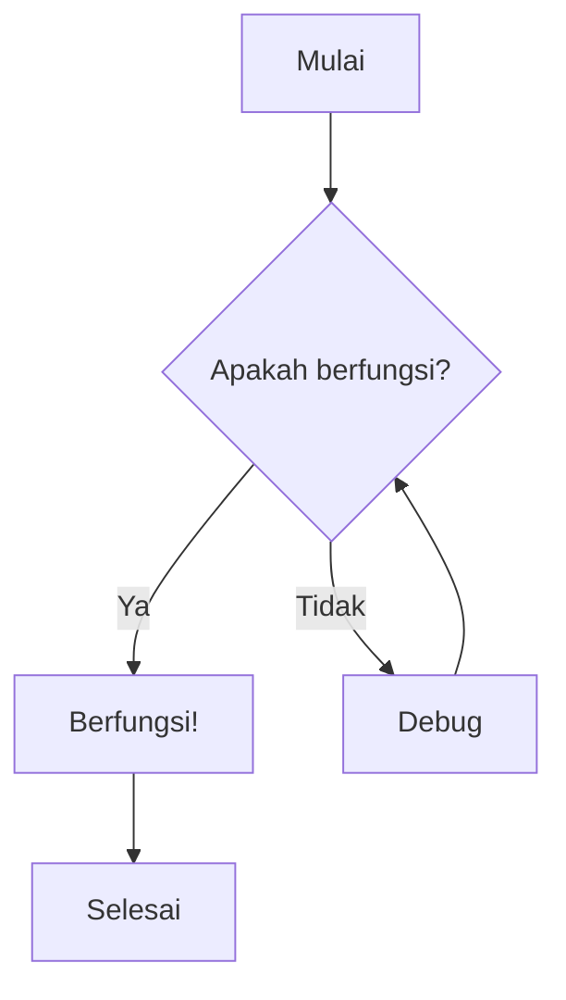
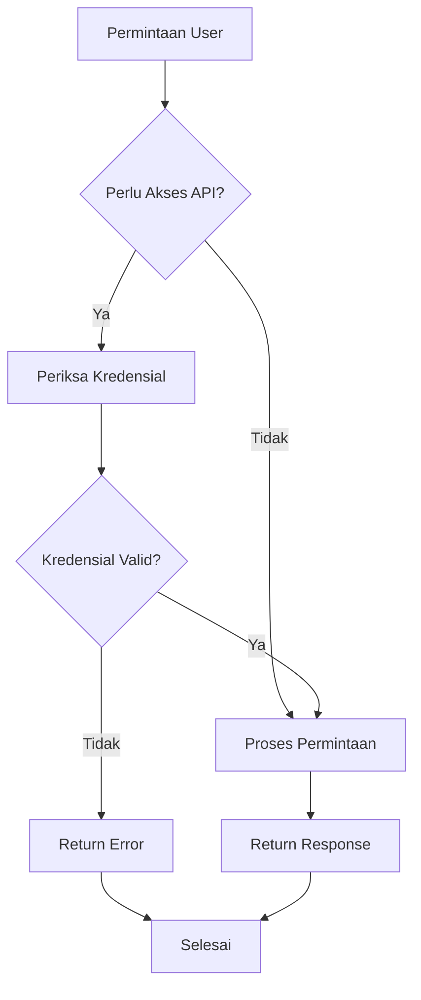
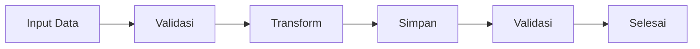
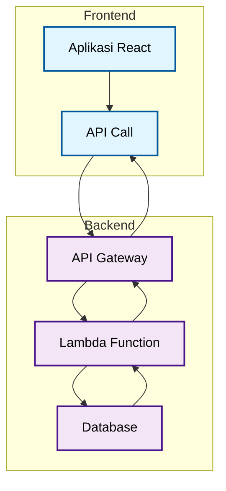

### Diagram Alur Dasar

### Contoh Pohon Keputusan

### Alur Proses

## Diagram Alur Bertingkat

### Alur Kerja Kompleks

## Referensi Sintaks Diagram Alur

### Bentuk Node

| Bentuk          | Sintaks     | Kasus Penggunaan |
| --------------- | ----------- | ---------------- |
| Persegi Panjang | `A[Teks]`   | Proses/Aksi      |
| Belah Ketupat   | `A{Teks}`   | Keputusan        |
| Lingkaran       | `A((Teks))` | Mulai/Selesai    |
| Stadium         | `A([Teks])` | Mulai/Selesai    |
| Silinder        | `A[(Teks)]` | Database         |
| Jajaran Genjang | `A[/Teks/]` | Input/Output     |

### Jenis Koneksi

| Jenis       | Sintaks    | Deskripsi      |     |                  |
| ----------- | ---------- | -------------- | --- | ---------------- |
| Panah       | `A --> B`  | Alur standar   |     |                  |
| Berlabel    | \`A --\>   | Label          | B\` | Koneksi berlabel |
| Putus-putus | `A -.-> B` | Opsional/Async |     |                  |
| Tebal       | `A ==> B`  | Alur penting   |     |                  |