# Arsitektur Sistem & Diagram Alur

Halaman ini menyediakan diagram alur dan ilustrasi yang mendetail mengenai arsitektur serta alur data dari Sistem Pemantauan Listrik berdasarkan implementasi sebenarnya.

## Diagram Alur Sistem Keseluruhan

```mermaid
flowchart TD
    A[Pengguna Mengakses Aplikasi] --> B[Dasbor Dimuat]
    
    B --> C[Tajuk Aplikasi]
    C --> C1[Logo dan Judul Aplikasi]
    C --> C2[Status Koneksi Firebase]
    C --> C3[Tampilan Waktu]
    C --> C4[Tombol Tema]
    C --> C5[Tombol Sinkronisasi]
    
    B --> D[Navigasi Tab]
    D --> D1[Tab Ikhtisar]
    D --> D2[Tab Tegangan]
    D --> D3[Tab Arus]
    D --> D4[Tab Daya]
    D --> D5[Tab Faktor Daya]
    D --> D6[Tab Perangkat]
    D --> D7[Tab Manajemen Data]
    
    B --> E[Lapisan Data]
    E --> E1[Hook Data Waktu Nyata Firebase]
    E1 --> E11[Layanan Firebase Realtime]
    E1 --> E12[Pemrosesan Data PZEM]
    E1 --> E13[Cache Optimal]
    
    E --> E2[Manajemen Data yang Ditingkatkan]
    E2 --> E21[Pengambilan Data Cerdas]
    E2 --> E22[Sinkronisasi Lanjutan]
    E2 --> E23[Penyimpanan Lokal]
    
    E --> E3[Pemantauan Kinerja]
    E3 --> E31[Pengumpulan Metrik]
    E3 --> E32[Optimalisasi Kinerja]
    E3 --> E33[Manajemen Memori]
    
    D1 --> F1[Kartu KPI]
    F1 --> F11[Kartu Tegangan Rata-rata]
    F1 --> F12[Kartu Arus Rata-rata]
    F1 --> F13[Kartu Daya Aktif]
    F1 --> F14[Kartu Faktor Daya]
    
    D1 --> F2[Grafik Ikhtisar]
    F2 --> F21[Grafik Tegangan]
    F2 --> F22[Grafik Daya]
    
    D2 --> G1[Statistik Tegangan]
    G1 --> G11[Kartu Fase R]
    G1 --> G12[Kartu Fase S]
    G1 --> G13[Kartu Fase T]
    
    D2 --> G2[Grafik Analisis Tegangan]
    G2 --> G21[Grafik Tegangan yang Ditingkatkan]
    G2 --> G22[Analisis Ketidakseimbangan]
    
    D2 --> G3[Metrik Kualitas Tegangan]
    G3 --> G31[THD Tegangan]
    G3 --> G32[Frekuensi]
    G3 --> G33[Regulasi Tegangan]
    G3 --> G34[Kedipan]
    
    D3 --> H1[Statistik Arus]
    H1 --> H11[Arus Fase R]
    H1 --> H12[Arus Fase S]
    H1 --> H13[Arus Fase T]
    
    D3 --> H2[Grafik Analisis Arus]
    H2 --> H21[Grafik Arus yang Ditingkatkan]
    H2 --> H22[Grafik Analisis THD]
    
    D3 --> H3[Analisis Kualitas Arus]
    H3 --> H31[THD Arus]
    H3 --> H32[Ketidakseimbangan Arus]
    H3 --> H33[Faktor Puncak]
    H3 --> H34[Faktor Beban]
    
    D4 --> I1[Statistik Daya]
    I1 --> I11[Daya Aktif]
    I1 --> I12[Daya Reaktif]
    I1 --> I13[Daya Semu]
    
    D4 --> I2[Grafik Daya]
    I2 --> I21[Grafik Daya yang Ditingkatkan]
    I2 --> I22[Segitiga Daya]
    
    D4 --> I3[Konsumsi Energi]
    I3 --> I31[Konsumsi Harian]
    I3 --> I32[Analisis Biaya]
    I3 --> I33[Emisi CO2]
    I3 --> I34[Informasi Tarif]
    
    D5 --> J1[Ikhtisar Faktor Daya]
    J1 --> J11[Faktor Daya Saat Ini]
    J1 --> J12[Faktor Daya Rata-rata]
    J1 --> J13[Sudut Fase]
    J1 --> J14[Kompensasi yang Diperlukan]
    
    D5 --> J2[Grafik Analisis Faktor Daya]
    J2 --> J21[Grafik Tren Faktor Daya]
    J2 --> J22[Analisis Kompensasi]
    
    D5 --> J3[Analisis Kualitas Faktor Daya]
    J3 --> J31[Klasifikasi Faktor Daya]
    J3 --> J32[Dampak Ekonomi]
    
    D6 --> K1[Pemantauan Perangkat]
    K1 --> K11[Kartu Perangkat PZEM]
    K1 --> K12[Status Perangkat]
    K1 --> K13[Parameter Listrik]
    K1 --> K14[Persentase Beban]
    K1 --> K15[Kualitas Daya]
    
    D6 --> K2[Sistem Peringatan]
    K2 --> K21[Peringatan Perangkat]
    K2 --> K22[Notifikasi Kesalahan]
    
    D6 --> K3[Metrik Ringkasan]
    K3 --> K31[Jumlah Status Normal]
    K3 --> K32[Beban Rata-rata]
    K3 --> K33[Efisiensi Sistem]
    
    D7 --> L1[Panel Manajemen Data]
    L1 --> L11[Ekspor Data]
    L1 --> L12[Impor Data]
    L1 --> L13[Penyaringan Data]
    L1 --> L14[Manajemen Cache]
    
    E11 --> M[Sensor PZEM - Firebase]
    M --> M1[Data Tegangan]
    M --> M2[Data Arus]
    M --> M3[Data Daya]
    M --> M4[Data Faktor Daya]
    
    E21 --> N[Penyimpanan Browser]
    N --> N1[IndexedDB]
    N --> N2[localStorage]
    
    style A fill:#e1f5fe
    style B fill:#e8f5e8
    style C fill:#f3e5f5
    style D fill:#fff3e0
    style E fill:#fce4ec
    
    classDef akses fill:#e1f5fe,stroke:#01579b;
    classDef dasbor fill:#e8f5e8,stroke:#1b5e20;
    classDef tajuk fill:#f3e5f5,stroke:#4a148c;
    classDef navigasi fill:#fff3e0,stroke:#e65100;
    classDef data fill:#fce4ec,stroke:#880e4f;
    classDef komponen fill:#e0f2f1,stroke:#004d40;
    classDef hardware fill:#f1f8e9,stroke:#33691e;
    classDef penyimpanan fill:#ffebee,stroke:#b71c1c;
```

## Arsitektur Sistem yang Sebenarnya

```mermaid
flowchart TD
    subgraph Lapisan_Presentasi["Lapisan Presentasi"]
        A[Pengguna Mengakses Aplikasi] --> B[Dasbor Next.js]
        
        B --> C[Komponen Tajuk]
        C --> C1[Logo dan Informasi Aplikasi]
        C --> C2[Status Koneksi Firebase]
        C --> C3[Tampilan Waktu Real-time]
        C --> C4[Tombol Tema Gelap/Terang]
        C --> C5[Tombol Sinkronisasi Data]
        
        B --> D[Navigasi Tab Interaktif]
        D --> D1[Tab Ikhtisar - Ringkasan Sistem]
        D --> D2[Tab Tegangan - Analisis Tegangan]
        D --> D3[Tab Arus - Analisis Arus]
        D --> D4[Tab Daya - Analisis Daya]
        D --> D5[Tab Faktor Daya - Analisis PF]
        D --> D6[Tab Perangkat - Status PZEM]
        D --> D7[Tab Manajemen Data - Ekspor/Impor]
    end
    
    subgraph Lapisan_Logika_Bisnis["Lapisan Logika Bisnis"]
        B --> E[Logika Dasbor Utama]
        
        E --> E1[Hook Data Waktu Nyata Firebase]
        E1 --> E11[Layanan Firebase Realtime Service]
        E1 --> E12[Pemrosesan Data PZEM Otomatis]
        E1 --> E13[Sistem Cache Berkinerja Tinggi]
        
        E --> E2[Hook Manajemen Data Lanjutan]
        E2 --> E21[Pengambilan Data Cerdas]
        E2 --> E22[Sistem Sinkronisasi Lanjutan]
        E2 --> E23[Penyimpanan Lokal Terenkapsulasi]
        
        E --> E3[Hook Pemantauan Kinerja]
        E3 --> E31[Pengumpulan Metrik Real-time]
        E3 --> E32[Optimalisasi Kinerja Aplikasi]
        E3 --> E33[Manajemen Penggunaan Memori]
    end
    
    subgraph Komponen_UI["Komponen Antarmuka Pengguna"]
        D1 --> F1[Sistem Kartu KPI]
        F1 --> F11[Kartu Tegangan Rata-rata]
        F1 --> F12[Kartu Arus Rata-rata]
        F1 --> F13[Kartu Daya Aktif Total]
        F1 --> F14[Kartu Faktor Daya Rata-rata]
        
        D1 --> F2[Grafik Visualisasi Ikhtisar]
        F2 --> F21[Grafik Tegangan Multi-fase]
        F2 --> F22[Grafik Daya Gabungan]
        
        D2 --> G1[Panel Statistik Tegangan]
        G1 --> G11[Indikator Tegangan Fase R]
        G1 --> G12[Indikator Tegangan Fase S]
        G1 --> G13[Indikator Tegangan Fase T]
        
        D2 --> G2[Grafik Analisis Tegangan Lanjutan]
        G2 --> G21[Grafik Tegangan yang Dioptimalkan]
        G2 --> G22[Analisis Ketidakseimbangan Fase]
        
        D2 --> G3[Panel Metrik Kualitas Tegangan]
        G3 --> G31[THD Tegangan - Distorsi Harmonik]
        G3 --> G32[Frekuensi Sistem]
        G3 --> G33[Regulasi Tegangan]
        G3 --> G34[Deteksi Kedipan]
        
        D3 --> H1[Panel Statistik Arus]
        H1 --> H11[Pengukuran Arus Fase R]
        H1 --> H12[Pengukuran Arus Fase S]
        H1 --> H13[Pengukuran Arus Fase T]
        
        D3 --> H2[Grafik Analisis Arus]
        H2 --> H21[Grafik Arus yang Ditingkatkan]
        H2 --> H22[Grafik Analisis THD Arus]
        
        D3 --> H3[Panel Analisis Kualitas Arus]
        H3 --> H31[THD Arus - Distorsi Harmonik]
        H3 --> H32[Ketidakseimbangan Arus]
        H3 --> H33[Faktor Puncak Gelombang]
        H3 --> H34[Faktor Beban Sistem]
        
        D4 --> I1[Panel Statistik Daya]
        I1 --> I11[Daya Aktif - Daya Kerja]
        I1 --> I12[Daya Reaktif - Daya Magnetik]
        I1 --> I13[Daya Semu - Daya Total]
        
        D4 --> I2[Grafik Visualisasi Daya]
        I2 --> I21[Grafik Daya yang Dioptimalkan]
        I2 --> I22[Visualisasi Segitiga Daya]
        
        D4 --> I3[Panel Konsumsi Energi]
        I3 --> I31[Kalkulasi Konsumsi Harian]
        I3 --> I32[Analisis Biaya Energi]
        I3 --> I33[Estimasi Emisi CO2]
        I3 --> I34[Informasi Tarif Listrik]
        
        D5 --> J1[Panel Ikhtisar Faktor Daya]
        J1 --> J11[Faktor Daya Saat Ini]
        J1 --> J12[Faktor Daya Rata-rata Historis]
        J1 --> J13[Sudut Fase Listrik]
        J1 --> J14[Kebutuhan Kompensasi Reaktif]
        
        D5 --> J2[Grafik Analisis Faktor Daya]
        J2 --> J21[Grafik Tren Faktor Daya]
        J2 --> J22[Analisis Kompensasi Daya]
        
        D5 --> J3[Panel Analisis Kualitas PF]
        J3 --> J31[Klasifikasi Faktor Daya]
        J3 --> J32[Dampak Ekonomi PF]
        
        D6 --> K1[Sistem Pemantauan Perangkat]
        K1 --> K11[Kartu Status Perangkat PZEM]
        K1 --> K12[Indikator Status Koneksi]
        K1 --> K13[Parameter Listrik Per Perangkat]
        K1 --> K14[Persentase Beban Per Perangkat]
        K1 --> K15[Indikator Kualitas Daya]
        
        D6 --> K2[Sistem Peringatan dan Notifikasi]
        K2 --> K21[Peringatan Ketidaknormalan]
        K2 --> K22[Notifikasi Kesalahan Sistem]
        
        D6 --> K3[Panel Metrik Ringkasan]
        K3 --> K31[Statistik Status Normal]
        K3 --> K32[Beban Sistem Rata-rata]
        K3 --> K33[Efisiensi Keseluruhan Sistem]
        
        D7 --> L1[Panel Manajemen Data Lanjutan]
        L1 --> L11[Fungsionalitas Ekspor Data]
        L1 --> L12[Fungsionalitas Impor Data]
        L1 --> L13[Sistem Penyaringan Data]
        L1 --> L14[Manajemen Cache Aplikasi]
    end
    
    subgraph Sumber_Data["Sumber Data Eksternal"]
        E11 --> M[Sensor PZEM yang Terhubung ke Firebase]
        M --> M1[Data Tegangan 3 Fase]
        M --> M2[Data Arus 3 Fase]
        M --> M3[Data Daya dan Energi]
        M --> M4[Data Faktor Daya]
        
        E21 --> N[Sistem Penyimpanan Browser]
        N --> N1[IndexedDB - Penyimpanan Data Besar]
        N --> N2[localStorage - Preferensi Pengguna]
    end
    
    E11 -.-> M
    E21 -.-> N
    
    style Lapisan_Presentasi fill:#e3f2fd
    style Lapisan_Logika_Bisnis fill:#f3e5f5
    style Komponen_UI fill:#e8f5e8
    style Sumber_Data fill:#fff3e0
    
    classDef presentasi fill:#e3f2fd,stroke:#0d47a1;
    classDef logika fill:#f3e5f5,stroke:#4a148c;
    classDef ui fill:#e8f5e8,stroke:#1b5e20;
    classDef data fill:#fff3e0,stroke:#e65100;
    
    class A,B,C,D,Lapisan_Presentasi presentasi
    class E,E1,E2,E3,Lapisan_Logika_Bisnis logika
    class F1,F2,G1,G2,G3,H1,H2,H3,I1,I2,I3,J1,J2,J3,K1,K2,K3,L1,Komponen_UI ui
    class M,M1,M2,M3,M4,N,N1,N2,Sumber_Data data
```

## Pipeline Pemrosesan Data yang Sebenarnya

```mermaid
flowchart TD
    subgraph Pengumpulan_Data["Pengumpulan Data dari Hardware"]
        A[Sensor PZEM 3 Fase] --> B[Firebase Realtime Database]
        B --> C[Stream Data Real-time]
    end
    
    subgraph Pipeline_Pemrosesan["Pipeline Pemrosesan Data Aplikasi"]
        C --> D[Hook useOptimizedRealtimeElectricalData]
        D --> E[Layanan Firebase Realtime Service]
        E --> F[Pemrosesan Data PZEM]
        F --> G[Cache Optimal dengan LRU]
        G --> H[Buffer Data Real-time]
        
        D --> I[Sistem Pengumpulan Metrik]
        I --> J[Pengukuran Latensi]
        I --> K[Penghitung Cache Hit Rate]
        I --> L[Pemantauan Penggunaan Memori]
    end
    
    subgraph Manajemen_Data_Lanjutan["Sistem Manajemen Data Lanjutan"]
        M[Hook useEnhancedDataManagement] --> N[Pengambilan Data Cerdas]
        N --> O[Fetcher Data yang Dioptimalkan]
        O --> P[Penyaringan Data Lanjutan]
        P --> Q[Agregasi Data Berbasis Waktu]
        
        M --> R[Sistem Sinkronisasi Lanjutan]
        R --> S[Sync Manager yang Cerdas]
        S --> T[Konfigurasi Sinkronisasi Fleksibel]
        T --> U[Manajemen Konflik Data]
        
        M --> V[Penyimpanan Persisten]
        V --> W[Layer Penyimpanan Lanjutan]
        W --> X[IndexedDB untuk Dataset Besar]
        W --> Y[localStorage untuk Preferensi]
    end
    
    subgraph Distribusi_Data["Distribusi Data ke Komponen UI"]
        H --> Z1[Data Listrik Real-time]
        Z1 --> AA[Filter Konteks Berdasarkan Tab]
        AA --> AB[Data untuk Tab Ikhtisar]
        AA --> AC[Data untuk Tab Tegangan]
        AA --> AD[Data untuk Tab Arus]
        AA --> AE[Data untuk Tab Daya]
        AA --> AF[Data untuk Tab Faktor Daya]
        AA --> AG[Data untuk Tab Perangkat]
        
        Q --> Z1
    end
    
    subgraph Rendering_Komponen["Rendering Komponen Berdasarkan Tab Aktif"]
        AB --> BA[Komponen Tab Ikhtisar]
        BA --> BB[Kartu KPI Dinamis]
        BA --> BC[Grafik Visualisasi]
        
        AC --> CA[Komponen Tab Tegangan]
        CA --> CB[Statistik Tegangan Fase]
        CA --> CC[Grafik Analisis Tegangan]
        CA --> CD[Metrik Kualitas Tegangan]
        
        AD --> DA[Komponen Tab Arus]
        DA --> DB[Statistik Arus Fase]
        DA --> DC[Grafik Analisis Arus]
        DA --> DD[Metrik Kualitas Arus]
        
        AE --> EA[Komponen Tab Daya]
        EA --> EB[Statistik Daya]
        EA --> EC[Grafik Visualisasi Daya]
        EA --> ED[Analisis Konsumsi Energi]
        
        AF --> FA[Komponen Tab Faktor Daya]
        FA --> FB[Ikhtisar Faktor Daya]
        FA --> FC[Grafik Analisis PF]
        FA --> FD[Metrik Kualitas Faktor Daya]
        
        AG --> GA[Komponen Tab Perangkat]
        GA --> GB[Pemantauan Status PZEM]
        GA --> GC[Sistem Peringatan]
        GA --> GD[Metrik Ringkasan Sistem]
    end
    
    subgraph Interaksi_Pengguna["Interaksi Pengguna"]
        HA[Navigasi Tab] --> AA
        HB[Pemilihan Periode Waktu] --> AA
        HC[Tombol Sinkronisasi] --> R
        HD[Tombol Tema] --> IA[Re-rendering UI]
        HE[Panel Manajemen Data] --> M
    end
    
    subgraph Optimalisasi_Kinerja["Sistem Optimalisasi Kinerja"]
        I --> JA[Pengumpulan Metrik Kinerja]
        JA --> JB[Analisis Kinerja Real-time]
        JB --> JC[Rekomendasi Optimalisasi]
        JC --> JD[Penyesuaian Otomatis]
        
        G --> KA[Sistem Cache Lanjutan]
        KA --> KB[Eviction LRU]
        KA --> KC[TTL Cache]
        KA --> KD[Buffer Data Optimal]
    end
    
    style Pengumpulan_Data fill:#e3f2fd
    style Pipeline_Pemrosesan fill:#f3e5f5
    style Manajemen_Data_Lanjutan fill:#e8f5e8
    style Distribusi_Data fill:#fff3e0
    style Rendering_Komponen fill:#fce4ec
    style Interaksi_Pengguna fill:#e0f2f1
    style Optimalisasi_Kinerja fill:#f1f8e9
    
    classDef pengumpulan fill:#e3f2fd,stroke:#0d47a1;
    classDef pemrosesan fill:#f3e5f5,stroke:#4a148c;
    classDef manajemen fill:#e8f5e8,stroke:#1b5e20;
    classDef distribusi fill:#fff3e0,stroke:#e65100;
    classDef rendering fill:#fce4ec,stroke:#880e4f;
    classDef interaksi fill:#e0f2f1,stroke:#004d40;
    classDef optimalisasi fill:#f1f8e9,stroke:#33691e;
    
    class A,B,C,Pengumpulan_Data pengumpulan
    class D,E,F,G,H,I,J,K,L,Pipeline_Pemrosesan pemrosesan
    class M,N,O,P,Q,R,S,T,U,V,W,X,Y,Manajemen_Data_Lanjutan manajemen
    class Z1,AA,AB,AC,AD,AE,AF,AG,Distribusi_Data distribusi
    class BA,BB,BC,CA,CB,CC,CD,DA,DB,DC,DD,EA,EB,EC,ED,FA,FB,FC,FD,GA,GB,GC,GD,Rendering_Komponen rendering
    class HA,HB,HC,HD,HE,IA,Interaksi_Pengguna interaksi
    class I,JA,JB,JC,JD,KA,KB,KC,KD,Optimalisasi_Kinerja optimalisasi
```

Diagram alur ini mengilustrasikan arsitektur sebenarnya dari Sistem Pemantauan Listrik:

1. **Diagram Alur Sistem Keseluruhan** - Menunjukkan komponen utama dan alur interaksi pengguna dengan sistem
2. **Arsitektur Sistem yang Sebenarnya** - Menampilkan arsitektur berlapis dengan presentasi, logika bisnis, komponen UI, dan sumber data
3. **Pipeline Pemrosesan Data yang Sebenarnya** - Menjelaskan secara rinci bagaimana data mengalir dari sensor PZEM melalui pemrosesan hingga rendering UI

Diagram ini tidak lagi menyertakan autentikasi karena sistem ini tidak memerlukan proses autentikasi pengguna.