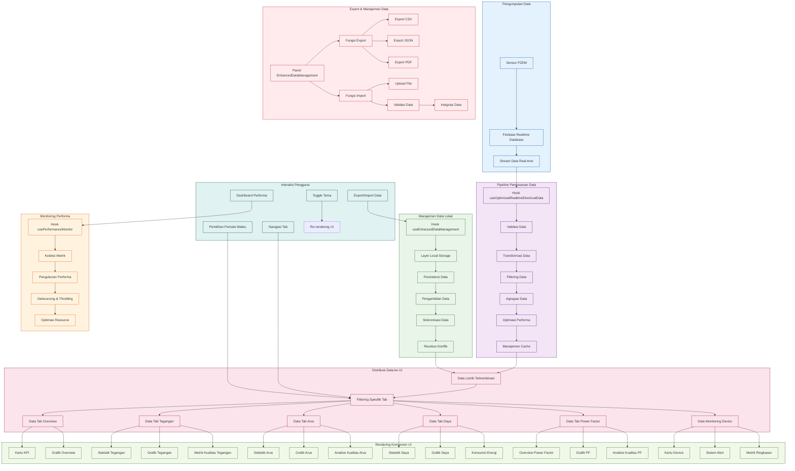

# Arsitektur Sistem & Diagram Alur

Halaman ini menyediakan diagram alur dan bagan detail yang menggambarkan arsitektur dan alur data dari Sistem Monitoring Listrik yang dikembangkan oleh Riswandi, S.T., M.Sos untuk iot-siaga.rri.go.id.

<Note>
Sistem ini menggunakan sensor PZEM-004T untuk monitoring listrik 3 fase dengan integrasi Firebase real-time dan optimasi performa tinggi.
</Note>

## Diagram Alur Utama

```mermaid
flowchart TD
    A[Akses Pengguna] --> B{Autentikasi}
    B -->|Terautentikasi| C[Pemuatan Dashboard]
    B -->|Tidak Terautentikasi| D[Halaman Login]
    D --> B
    
    C --> E[Komponen Header]
    E --> E1[Tampilan Logo]
    E --> E2[Status Koneksi]
    E --> E3[Tampilan Waktu]
    E --> E4[Toggle Tema]
    
    C --> F[Navigasi Tab]
    F --> F1[Tab Overview]
    F --> F2[Tab Analisis Tegangan]
    F --> F3[Tab Analisis Arus]
    F --> F4[Tab Analisis Daya]
    F --> F5[Tab Power Factor]
    F --> F6[Tab Monitoring Device]
    F --> F7[Tab Manajemen Data]
    
    C --> G[Layer Data]
    G --> G1[Hook Data Real-time]
    G1 --> G11[Koneksi Firebase]
    G1 --> G12[Pemrosesan Data]
    G1 --> G13[Manajemen Cache]
    
    G --> G2[Manajemen Data Enhanced]
    G2 --> G21[Local Storage]
    G2 --> G22[Filtering Data]
    G2 --> G23[Agregasi Data]
    
    G --> G3[Monitoring Performa]
    G3 --> G31[Koleksi Metrik]
    G3 --> G32[Optimasi Performa]
    
    F1 --> H1[Kartu KPI]
    H1 --> H11[Kartu Tegangan]
    H1 --> H12[Kartu Arus]
    H1 --> H13[Kartu Daya]
    H1 --> H14[Kartu Power Factor]
    
    F1 --> H2[Grafik Overview]
    H2 --> H21[Grafik Tegangan]
    H2 --> H22[Grafik Daya]
    
    F2 --> I1[Statistik Tegangan]
    I1 --> I11[Kartu Phase R]
    I1 --> I12[Kartu Phase S]
    I1 --> I13[Kartu Phase T]
    
    F2 --> I2[Grafik Analisis Tegangan]
    I2 --> I21[Grafik Tegangan Improved]
    I2 --> I22[Analisis Ketidakseimbangan]
    
    F2 --> I3[Metrik Kualitas Tegangan]
    I3 --> I31[THD Tegangan]
    I3 --> I32[Frekuensi]
    I3 --> I33[Regulasi Tegangan]
    I3 --> I34[Flicker]
    
    F3 --> J1[Statistik Arus]
    J1 --> J11[Arus Phase R]
    J1 --> J12[Arus Phase S]
    J1 --> J13[Arus Phase T]
    
    F3 --> J2[Grafik Analisis Arus]
    J2 --> J21[Grafik Arus Improved]
    J2 --> J22[Grafik Analisis THD]
    
    F3 --> J3[Analisis Kualitas Arus]
    J3 --> J31[THD Arus]
    J3 --> J32[Ketidakseimbangan Arus]
    J3 --> J33[Crest Factor]
    J3 --> J34[Load Factor]
    
    F4 --> K1[Statistik Daya]
    K1 --> K11[Daya Aktif]
    K1 --> K12[Daya Reaktif]
    K1 --> K13[Daya Semu]
    
    F4 --> K2[Grafik Daya]
    K2 --> K21[Grafik Daya Improved]
    K2 --> K22[Segitiga Daya]
    
    F4 --> K3[Konsumsi Energi]
    K3 --> K31[Konsumsi Harian]
    K3 --> K32[Analisis Biaya]
    K3 --> K33[Emisi CO2]
    K3 --> K34[Info Tarif]
    
    F5 --> L1[Overview Power Factor]
    L1 --> L11[PF Saat Ini]
    L1 --> L12[PF Rata-rata]
    L1 --> L13[Sudut Phase]
    L1 --> L14[Kompensasi Diperlukan]
    
    F5 --> L2[Grafik Analisis PF]
    L2 --> L21[Grafik Trend PF]
    L2 --> L22[Analisis Kompensasi]
    
    F5 --> L3[Analisis Kualitas PF]
    L3 --> L31[Klasifikasi PF]
    L3 --> L32[Dampak Ekonomi]
    
    F6 --> M1[Monitoring Device]
    M1 --> M11[Kartu Device]
    M1 --> M12[Status Device]
    M1 --> M13[Parameter Listrik]
    M1 --> M14[Persentase Beban]
    M1 --> M15[Kualitas Daya]
    
    F6 --> M2[Sistem Alert]
    M2 --> M21[Peringatan Device]
    M2 --> M22[Notifikasi Error]
    
    F6 --> M3[Metrik Ringkasan]
    M3 --> M31[Jumlah Status Normal]
    M3 --> M32[Beban Rata-rata]
    M3 --> M33[Efisiensi Sistem]
    
    F7 --> N1[Panel Manajemen Data]
    N1 --> N11[Export Data]
    N1 --> N12[Import Data]
    N1 --> N13[Filtering Data]
    N1 --> N14[Manajemen Cache]
    
    G11 --> O[Firebase Realtime Database]
    O --> O1[Data Sensor PZEM]
    O --> O2[Data Historis]
    
    G21 --> P[Browser Local Storage]
    P --> P1[Pengukuran Tersimpan]
    P --> P2[Preferensi Pengguna]
    P --> P3[Data Cache]
    
    style A fill:#e1f5fe
    style B fill:#f3e5f5
    style C fill:#e8f5e8
    style F fill:#fff3e0
    style G fill:#fce4ec
    style O fill:#f1f8e9
    style P fill:#e0f2f1
    
    classDef userInterface fill:#e1f5fe,stroke:#01579b;
    classDef auth fill:#f3e5f5,stroke:#4a148c;
    classDef dashboard fill:#e8f5e8,stroke:#1b5e20;
    classDef navigation fill:#fff3e0,stroke:#e65100;
    classDef dataLayer fill:#fce4ec,stroke:#880e4f;
    classDef database fill:#f1f8e9,stroke:#33691e;
    classDef storage fill:#e0f2f1,stroke:#004d40;
```

## Arsitektur Sistem

```mermaid
flowchart TD
    subgraph USER_INTERFACE["Layer Antarmuka Pengguna"]
        A[Akses Pengguna] --> B{Autentikasi}
        B -->|Terautentikasi| C[Halaman Dashboard Next.js]
        B -->|Tidak Terautentikasi| D[Halaman Login]
        D --> B
        
        C --> E[Komponen Header]
        E --> E1[Tampilan Logo]
        E --> E2[Status Koneksi]
        E --> E3[Tampilan Waktu]
        E --> E4[Toggle Tema]
        
        C --> F[Navigasi Tab]
        F --> F1[Tab Overview]
        F --> F2[Tab Analisis Tegangan]
        F --> F3[Tab Analisis Arus]
        F --> F4[Tab Analisis Daya]
        F --> F5[Tab Power Factor]
        F --> F6[Tab Monitoring Device]
        F --> F7[Tab Manajemen Data]
    end
    
    subgraph DATA_FLOW["Layer Alur Data"]
        C --> G[Pipeline Pemrosesan Data]
        
        G --> G1[Hook Data Real-time]
        G1 --> G11[Layer Service Firebase]
        G1 --> G12[Transformasi Data]
        G1 --> G13[Manajemen Cache]
        
        G --> G2[Manajemen Data Enhanced]
        G2 --> G21[Manager Local Storage]
        G2 --> G22[Engine Filtering Data]
        G2 --> G23[Service Agregasi Data]
        
        G --> G3[Monitoring Performa]
        G3 --> G31[Koleksi Metrik]
        G3 --> G32[Optimasi Performa]
        
        G11 --> H[Firebase Realtime Database]
        G21 --> I[Browser Local Storage]
    end
    
    subgraph COMPONENTS["Komponen UI & Visualisasi"]
        F1 --> J1[Sistem Kartu KPI]
        J1 --> J11[Kartu Tegangan]
        J1 --> J12[Kartu Arus]
        J1 --> J13[Kartu Daya]
        J1 --> J14[Kartu Power Factor]
        
        F1 --> J2[Grafik Overview]
        J2 --> J21[Grafik Tegangan]
        J2 --> J22[Grafik Daya]
        
        F2 --> K1[Statistik Tegangan]
        K1 --> K11[Kartu Phase R]
        K1 --> K12[Kartu Phase S]
        K1 --> K13[Kartu Phase T]
        
        F2 --> K2[Grafik Analisis Tegangan]
        K2 --> K21[Grafik Tegangan Improved]
        K2 --> K22[Analisis Ketidakseimbangan]
        
        F2 --> K3[Metrik Kualitas Tegangan]
        K3 --> K31[THD Tegangan]
        K3 --> K32[Frekuensi]
        K3 --> K33[Regulasi Tegangan]
        K3 --> K34[Flicker]
        
        F3 --> L1[Statistik Arus]
        L1 --> L11[Arus Phase R]
        L1 --> L12[Arus Phase S]
        L1 --> L13[Arus Phase T]
        
        F3 --> L2[Grafik Analisis Arus]
        L2 --> L21[Grafik Arus Improved]
        L2 --> L22[Grafik Analisis THD]
        
        F3 --> L3[Analisis Kualitas Arus]
        L3 --> L31[THD Arus]
        L3 --> L32[Ketidakseimbangan Arus]
        L3 --> L33[Crest Factor]
        L3 --> L34[Load Factor]
        
        F4 --> M1[Statistik Daya]
        M1 --> M11[Daya Aktif]
        M1 --> M12[Daya Reaktif]
        M1 --> M13[Daya Semu]
        
        F4 --> M2[Grafik Daya]
        M2 --> M21[Grafik Daya Improved]
        M2 --> M22[Segitiga Daya]
        
        F4 --> M3[Konsumsi Energi]
        M3 --> M31[Konsumsi Harian]
        M3 --> M32[Analisis Biaya]
        M3 --> M33[Emisi CO2]
        M3 --> M34[Info Tarif]
        
        F5 --> N1[Overview Power Factor]
        N1 --> N11[PF Saat Ini]
        N1 --> N12[PF Rata-rata]
        N1 --> N13[Sudut Phase]
        N1 --> N14[Kompensasi Diperlukan]
        
        F5 --> N2[Grafik Analisis PF]
        N2 --> N21[Grafik Trend PF]
        N2 --> N22[Analisis Kompensasi]
        
        F5 --> N3[Analisis Kualitas PF]
        N3 --> N31[Klasifikasi PF]
        N3 --> N32[Dampak Ekonomi]
        
        F6 --> O1[Monitoring Device]
        O1 --> O11[Kartu Device]
        O1 --> O12[Status Device]
        O1 --> O13[Parameter Listrik]
        O1 --> O14[Persentase Beban]
        O1 --> O15[Kualitas Daya]
        
        F6 --> O2[Sistem Alert]
        O2 --> O21[Peringatan Device]
        O2 --> O22[Notifikasi Error]
        
        F6 --> O3[Metrik Ringkasan]
        O3 --> O31[Jumlah Status Normal]
        O3 --> O32[Beban Rata-rata]
        O3 --> O33[Efisiensi Sistem]
        
        F7 --> P1[Panel Manajemen Data]
        P1 --> P11[Export Data]
        P1 --> P12[Import Data]
        P1 --> P13[Filtering Data]
        P1 --> P14[Manajemen Cache]
    end
    
    subgraph EXTERNAL_SERVICES["Layanan Eksternal"]
        H --> Q1[Sensor PZEM]
        H --> Q2[Firebase Cloud]
    end
    
    subgraph BROWSER_STORAGE["Penyimpanan Browser"]
        I --> R1[Pengukuran Tersimpan]
        I --> R2[Preferensi Pengguna]
        I --> R3[Data Cache]
    end
    
    G11 -.-> H
    G21 -.-> I
    
    style USER_INTERFACE fill:#e3f2fd
    style DATA_FLOW fill:#f3e5f5
    style COMPONENTS fill:#e8f5e8
    style EXTERNAL_SERVICES fill:#fff3e0
    style BROWSER_STORAGE fill:#fce4ec
    
    classDef uiLayer fill:#e3f2fd,stroke:#0d47a1;
    classDef dataLayer fill:#f3e5f5,stroke:#4a148c;
    classDef componentLayer fill:#e8f5e8,stroke:#1b5e20;
    classDef serviceLayer fill:#fff3e0,stroke:#e65100;
    classDef storageLayer fill:#fce4ec,stroke:#880e4f;
    
    class A,B,C,D,E,F,G,USER_INTERFACE uiLayer
    class G1,G2,G3,DATA_FLOW dataLayer
    class J1,J2,K1,K2,K3,L1,L2,L3,M1,M2,M3,N1,N2,N3,O1,O2,O3,P1,COMPONENTS componentLayer
    class H,Q1,Q2,EXTERNAL_SERVICES serviceLayer
    class I,R1,R2,R3,BROWSER_STORAGE storageLayer
```

<Info>
Arsitektur sistem menggunakan pendekatan berlapis dengan pemisahan yang jelas antara UI, pemrosesan data, dan penyimpanan untuk memastikan skalabilitas dan maintainability.
</Info>

## Pipeline Pemrosesan Data

## Fitur Sistem

### 🔄 Monitoring Real-time
- **Streaming Data PZEM**: Update data setiap 5 detik dari sensor PZEM-004T
- **Koneksi Firebase**: Integrasi real-time dengan Firebase Realtime Database
- **Status Koneksi**: Indikator visual status koneksi (Terhubung/Terputus/Menghubungkan)
- **Sinkronisasi Waktu**: Tampilan waktu real-time dengan format Indonesia

### ⚡ Analisis Kualitas Daya
- **THD Analysis**: Analisis Total Harmonic Distortion untuk tegangan dan arus
- **Power Factor**: Monitoring dan analisis faktor daya dengan klasifikasi kualitas
- **Voltage Regulation**: Perhitungan regulasi tegangan dan analisis flicker
- **Load Factor**: Analisis faktor beban dan efisiensi sistem

### 📊 Visualisasi Data
- **7 Tab Dashboard**: Overview, Tegangan, Arus, Daya, Power Factor, Device, Data Management
- **Grafik Interaktif**: Menggunakan Recharts dengan konfigurasi responsif
- **KPI Cards**: Kartu indikator kinerja utama dengan status real-time
- **Circular Gauges**: Indikator gauge melingkar untuk parameter kritis

### 🚀 Optimasi Performa
- **Intelligent Caching**: Cache cerdas dengan TTL berbeda per rentang waktu
- **Data Compression**: Kompresi data 60-80% untuk dataset besar
- **Memory Management**: Manajemen memori dengan circular buffer
- **Performance Monitoring**: Tracking performa real-time dengan metrik detail

<Warning>
Sistem memerlukan koneksi internet stabil untuk sinkronisasi Firebase dan performa optimal.
</Warning>

## Spesifikasi Teknis

### Sensor PZEM-004T
- **Tegangan**: 80-260V AC
- **Arus**: 0-100A
- **Daya**: 0-22kW
- **Frekuensi**: 45-65Hz
- **Akurasi**: ±1% untuk tegangan, ±1% untuk arus

### Strategi Penyimpanan
- **24 Jam**: localStorage (akses cepat, ~8MB, <1s load time)
- **7 Hari**: IndexedDB (dataset medium, ~58MB, <5s load time)
- **1 Bulan**: Hybrid (file system + kompresi, ~247MB, <10s load time)

### Target Performa
- **Filter 24h**: < 1 detik waktu loading
- **Filter 7d**: < 5 detik waktu loading
- **Filter 1m**: < 10 detik waktu loading
- **Memory Usage**: < 50MB peningkatan selama operasi
- **Compression**: 60-80% pengurangan ukuran untuk dataset besar

Diagram alur ini menggambarkan arsitektur lengkap Sistem Monitoring Listrik:

1. **Diagram Alur Utama** - Menampilkan komponen utama dan elemen antarmuka pengguna
2. **Arsitektur Sistem** - Menampilkan arsitektur berlapis dengan UI, Alur Data, Komponen, Layanan Eksternal, dan Penyimpanan Browser
3. **Pipeline Pemrosesan Data** - Detail bagaimana data mengalir dari sensor melalui pemrosesan hingga rendering UI

Setiap diagram dapat dilihat secara independen untuk memahami aspek berbeda dari sistem.