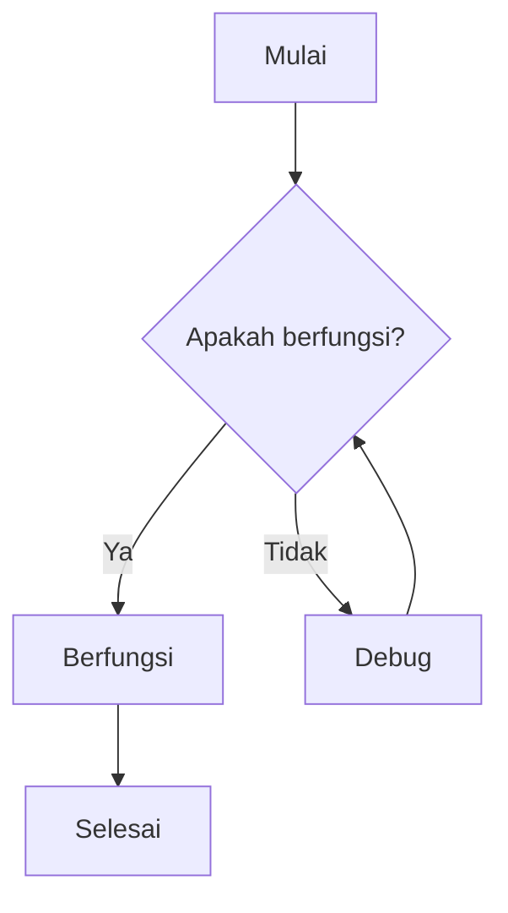
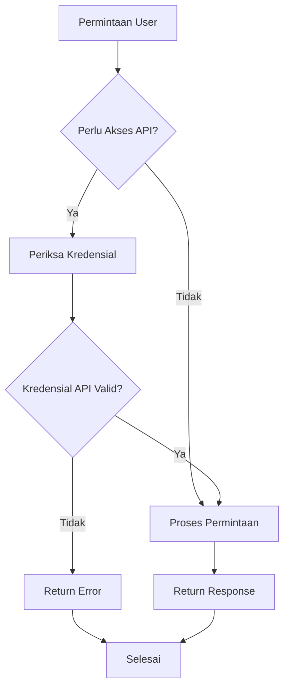
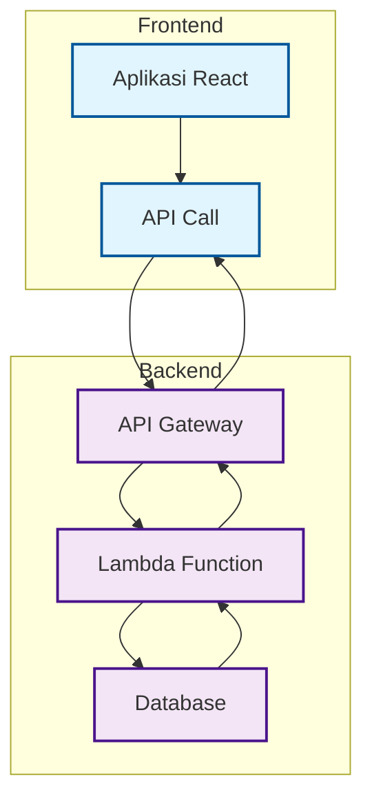
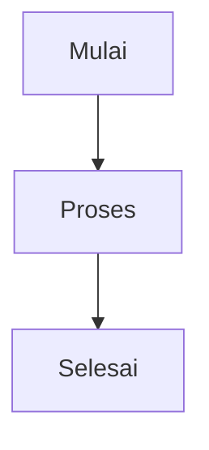
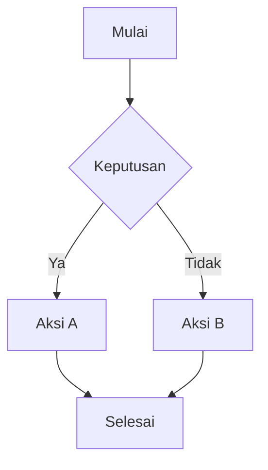
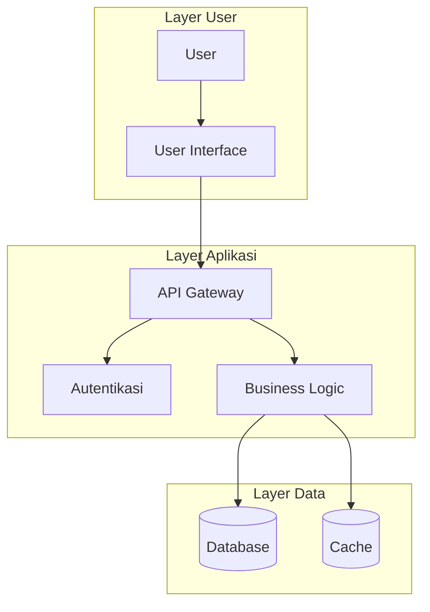

# Diagram Alur

Diagram alur adalah alat visual yang powerful untuk menjelaskan proses kompleks, pohon keputusan, dan alur kerja. Panduan ini menunjukkan cara membuat dan mengintegrasikan diagram alur ke dalam dokumentasi Anda.

## Ringkasan

Diagram alur dapat dibuat menggunakan berbagai metode:

- Diagram Mermaid (direkomendasikan)
- Alat diagram eksternal
- Embed gambar
- Diagram interaktif

## Diagram Alur Mermaid

Mermaid adalah cara paling populer untuk membuat diagram alur dalam dokumentasi. Menggunakan sintaks teks sederhana untuk menghasilkan diagram yang indah.

### Diagram Alur Dasar



### Contoh Pohon Keputusan



### Alur Proses

```mermaid
flowchart Gateway
    A[Kirim Data] --> B[Validasi]
    B --> C[Transform Data]
    C --> D[Simpan]
    D --> E[Selesai]
```

## Diagram Alur Interface



### Alur Kerja Kompleks


## Referensi Sintaks Diagram Alur

### Bentuk Node

| Bentuk          | Sintaks     | Kasus Penggunaan |
| --------------- | ----------- | ---------------- |
| Persegi Panjang | `A[Teks]`   | Proses/Aksi      |
| Belah Ketupat   | `A{Teks}`   | Keputusan        |
| Lingkaran       | `A((Teks))` | Mulai/Selesai    |
| Stadium         | `A([Teks])` | Mulai/Selesai    |
| Silinder        | `A[(Teks)]` | Database         |
| Jajaran Genjang | `A[/Teks/]` | Input/Output     |

### Jenis Koneksi

| Jenis       | Sintaks    | Deskripsi      |     |                  |
| ----------- | ---------- | -------------- | --- | ---------------- |
| Panah       | `A --> B`  | Alur standar   |     |                  |
| Berlabel    | \`A --\>   | Label          | B\` | Koneksi berlabel |
| Putus-putus | `A -.-> B` | Opsional/Async |     |                  |
| Tebal       | `A ==> B`  | Alur penting   |     |                  |

## Contoh Interaktif

<CodeGroup>









</CodeGroup>

## Tips Integrasi

### Dalam Dokumentasi

- Tempatkan diagram alur dekat dengan konten teks yang relevan
- Gunakan callout untuk menyoroti poin keputusan penting
- Sediakan versi yang dapat diunduh untuk presentasi

### Version Control

- Simpan kode sumber diagram dalam version control
- Gunakan pesan commit yang bermakna untuk perubahan diagram
- Pertimbangkan review diagram sebagai bagian dari review dokumentasi

<Warning>
  Diagram alur yang besar atau kompleks dapat mempengaruhi waktu loading halaman. Pertimbangkan menggunakan alat diagram eksternal untuk workflow yang sangat detail.
</Warning>

## Alat dan Sumber Daya

### Alat yang Direkomendasikan

- **Mermaid** - Diagram berbasis teks (built-in di Mintlify)
- **Lucidchart** - Diagramming profesional
- **Draw.io** - Diagramming online gratis
- **Figma** - Diagram fokus desain

### Bacaan Lebih Lanjut

- [Dokumentasi Mermaid](https://mermaid-js.github.io/mermaid/)
- [Praktik Terbaik Flowchart](https://www.lucidchart.com/pages/flowchart-best-practices)
- [Prinsip Desain Visual](https://www.interaction-design.org/literature/topics/visual-design)

---

Siap membuat diagram alur pertama Anda? Mulai dengan proses sederhana dan tambahkan kompleksitas secara bertahap sesuai kebutuhan.