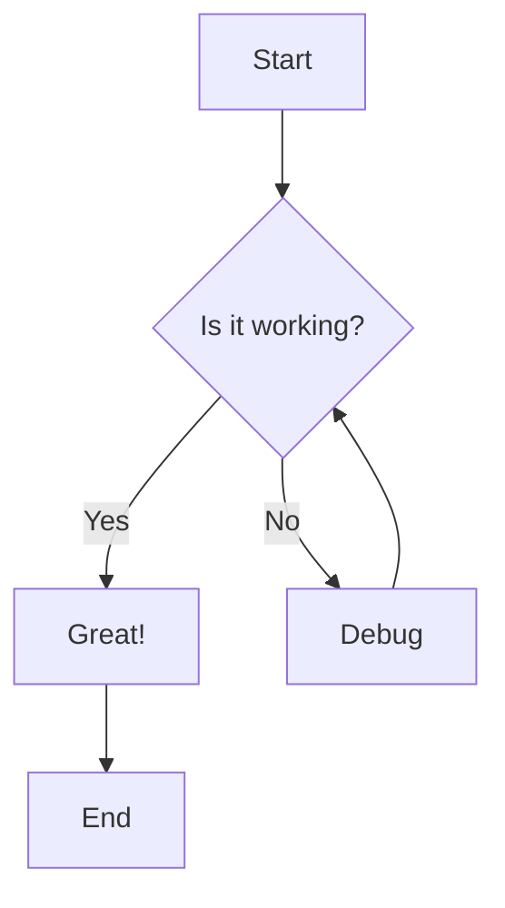
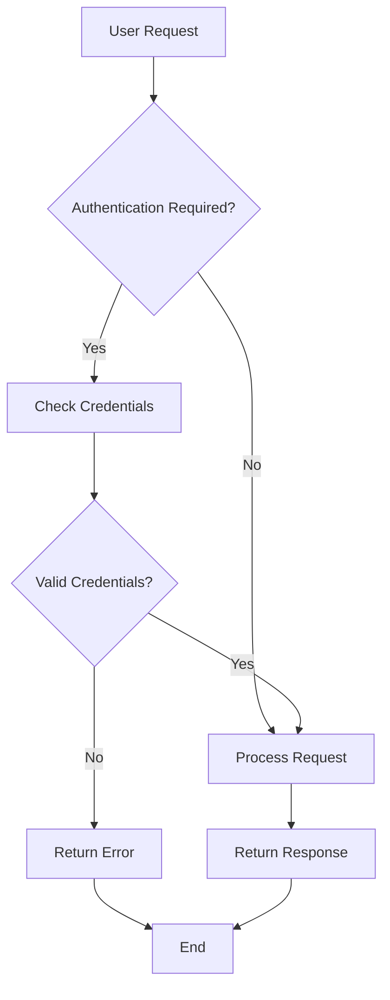
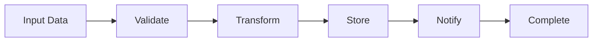
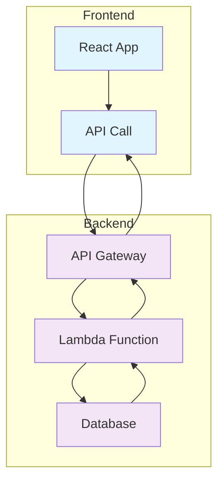
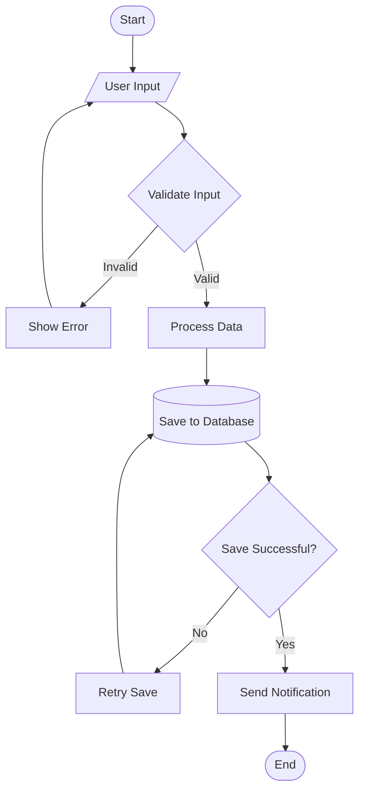
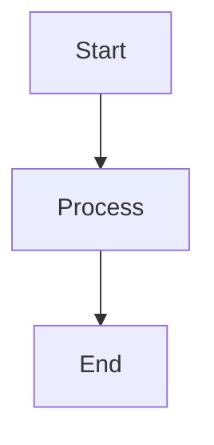
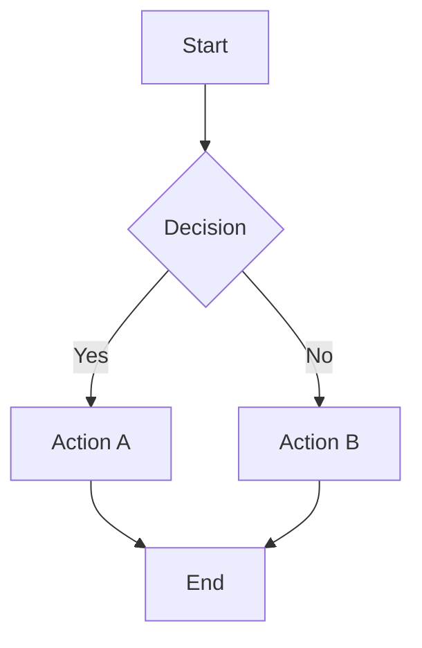
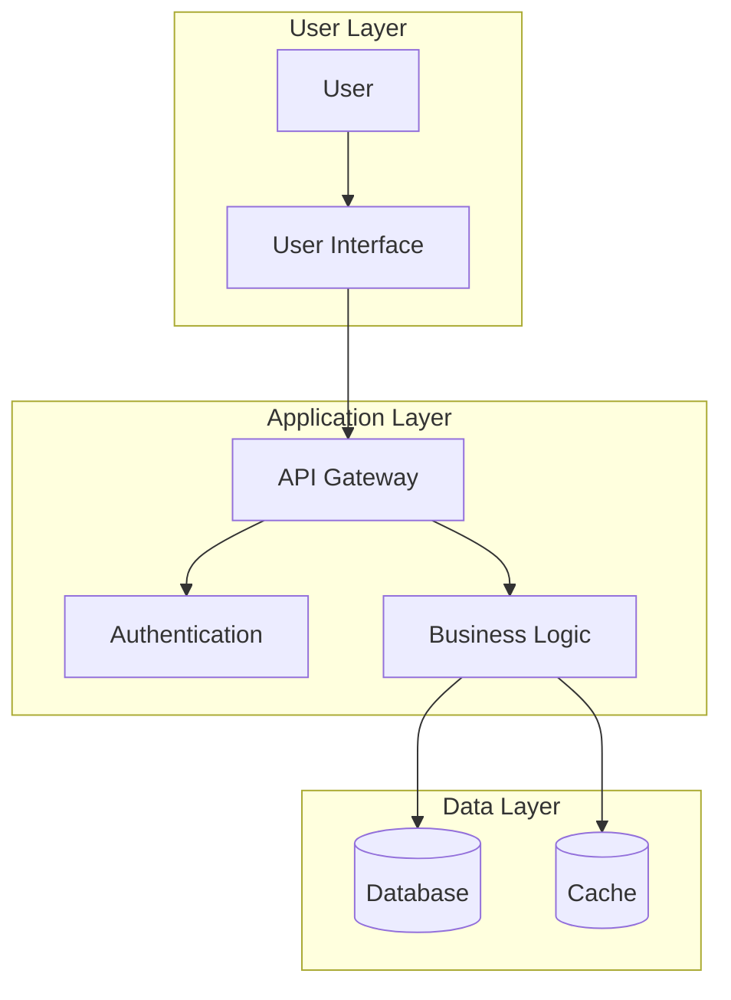

# Flowcharts

Flowcharts are powerful visual tools that help explain complex processes, decision trees, and workflows. This guide shows you how to create and integrate flowcharts into your documentation.

## Overview

Flowcharts can be created using various methods:
- Mermaid diagrams (recommended)
- External diagram tools
- Image embeds
- Interactive diagrams

## Mermaid Flowcharts

Mermaid is the most popular way to create flowcharts in documentation. It uses simple text syntax to generate beautiful diagrams.

### Basic Flowchart

### Decision Tree Example

### Process Flow

## Advanced Flowcharts

### Subgraphs and Styling

### Complex Workflow

## Flowchart Syntax Reference

### Node Shapes

| Shape | Syntax | Use Case |
|-------|--------|----------|
| Rectangle | `A[Text]` | Process/Action |
| Diamond | `A{Text}` | Decision |
| Circle | `A((Text))` | Start/End |
| Stadium | `A([Text])` | Start/End |
| Cylinder | `A[(Text)]` | Database |
| Parallelogram | `A[/Text/]` | Input/Output |

### Connection Types

| Type | Syntax | Description |
|------|--------|-------------|
| Arrow | `A --> B` | Standard flow |
| Labeled | `A -->|Label| B` | Labeled connection |
| Dotted | `A -.-> B` | Optional/Async |
| Thick | `A ==> B` | Important flow |

## Best Practices

<Tip>
Keep flowcharts simple and focused. If a diagram becomes too complex, consider breaking it into multiple smaller diagrams.
</Tip>

### Design Guidelines

1. **Start with purpose** - Define what the flowchart should communicate
2. **Use consistent shapes** - Stick to standard flowchart symbols
3. **Maintain flow direction** - Generally top-to-bottom or left-to-right
4. **Label clearly** - Use concise, descriptive labels
5. **Group related elements** - Use subgraphs for logical groupings

### Accessibility

- Provide alt text for complex diagrams
- Use high contrast colors
- Include text descriptions for screen readers
- Ensure diagrams are readable at different zoom levels

## Interactive Examples

<CodeGroup>

</CodeGroup>

## Integration Tips

### In Documentation

- Place flowcharts near relevant text content
- Use callouts to highlight important decision points
- Provide downloadable versions for presentations

### Version Control

- Keep diagram source code in version control
- Use meaningful commit messages for diagram changes
- Consider diagram reviews as part of documentation reviews

<Warning>
Large or complex flowcharts may impact page load times. Consider using external diagram tools for very detailed workflows.
</Warning>

## Tools and Resources

### Recommended Tools

- **Mermaid** - Text-based diagrams (built into Mintlify)
- **Lucidchart** - Professional diagramming
- **Draw.io** - Free online diagramming
- **Figma** - Design-focused diagrams

### Further Reading

- [Mermaid Documentation](https://mermaid-js.github.io/mermaid/)
- [Flowchart Best Practices](https://www.lucidchart.com/pages/flowchart-best-practices)
- [Visual Design Principles](https://www.interaction-design.org/literature/topics/visual-design)

---

Ready to create your first flowchart? Start with a simple process and gradually add complexity as needed.