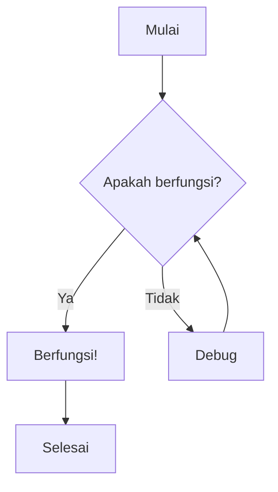
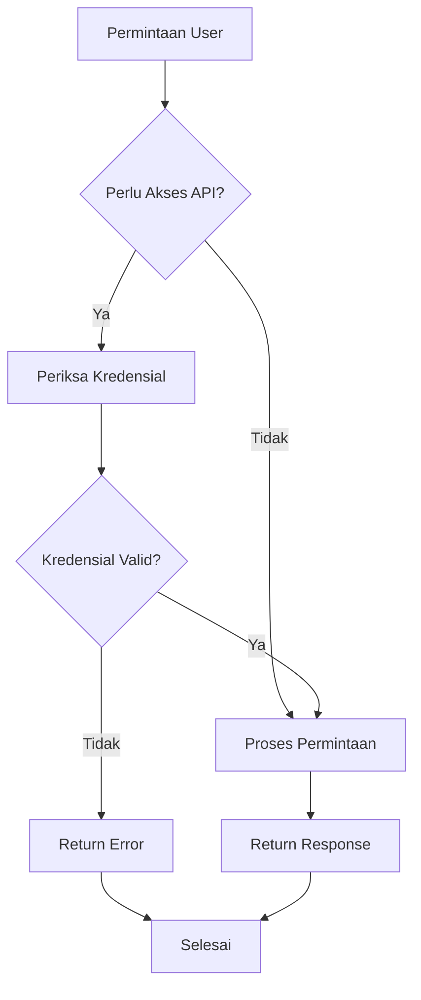
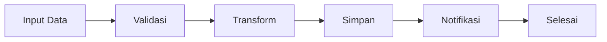
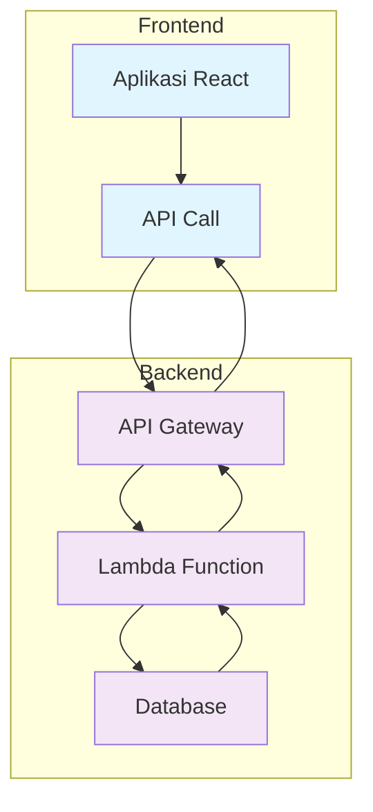
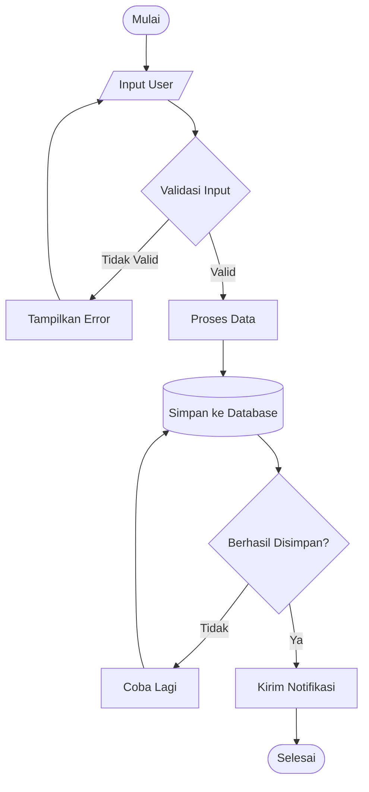
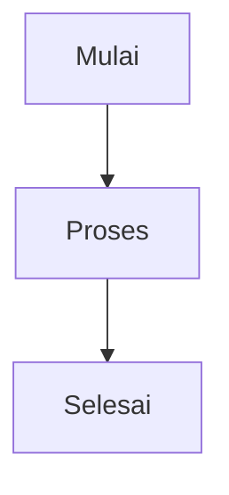
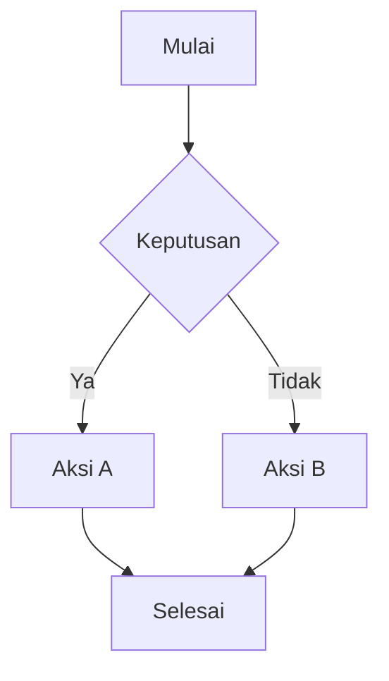
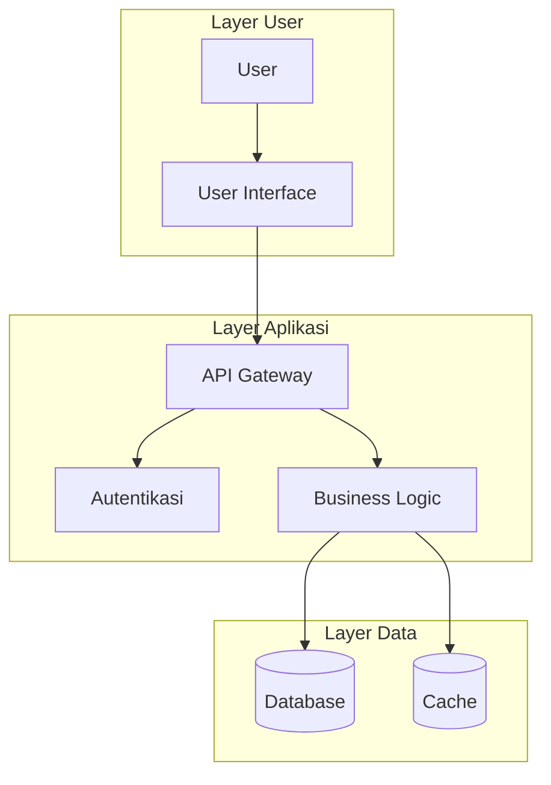

# Diagram Alur

Diagram alur adalah alat visual yang powerful untuk menjelaskan proses kompleks, pohon keputusan, dan alur kerja. Panduan ini menunjukkan cara membuat dan mengintegrasikan diagram alur ke dalam dokumentasi Anda.

## Ringkasan

Diagram alur dapat dibuat menggunakan berbagai metode:

- Diagram Mermaid (direkomendasikan)
- Alat diagram eksternal
- Embed gambar
- Diagram interaktif

## Diagram Alur Mermaid

Mermaid adalah cara paling populer untuk membuat diagram alur dalam dokumentasi. Menggunakan sintaks teks sederhana untuk menghasilkan diagram yang indah.

### Diagram Alur Dasar

### Contoh Pohon Keputusan

### Alur Proses

## Diagram Alur Lanjutan

### Subgraph dan Styling

### Alur Kerja Kompleks

## Referensi Sintaks Diagram Alur

### Bentuk Node

| Bentuk          | Sintaks     | Kasus Penggunaan |
| --------------- | ----------- | ---------------- |
| Persegi Panjang | `A[Teks]`   | Proses/Aksi      |
| Belah Ketupat   | `A{Teks}`   | Keputusan        |
| Lingkaran       | `A((Teks))` | Mulai/Selesai    |
| Stadium         | `A([Teks])` | Mulai/Selesai    |
| Silinder        | `A[(Teks)]` | Database         |
| Jajaran Genjang | `A[/Teks/]` | Input/Output     |

### Jenis Koneksi

<table style="min-width: 75px">
<colgroup><col style="min-width: 25px"><col style="min-width: 25px"><col style="min-width: 25px"></colgroup><tbody><tr><th colspan="1" rowspan="1">
Jenis
</th><th colspan="1" rowspan="1">
Sintaks
</th><th colspan="1" rowspan="1">
Deskripsi
</th></tr><tr><td colspan="1" rowspan="1">
Panah
</td><td colspan="1" rowspan="1">
<code spellcheck="false">A --&gt; B</code>
</td><td colspan="1" rowspan="1">
Alur standar
</td></tr><tr><td colspan="1" rowspan="1">
Berlabel
</td><td colspan="1" rowspan="1">
`A --&gt;
</td><td colspan="1" rowspan="1">
Label
</td><td colspan="1" rowspan="1">
B`
</td><td colspan="1" rowspan="1">
Koneksi berlabel
</td></tr><tr><td colspan="1" rowspan="1">
Putus-putus
</td><td colspan="1" rowspan="1">
<code spellcheck="false">A -.-&gt; B</code>
</td><td colspan="1" rowspan="1">
Opsional/Async
</td></tr><tr><td colspan="1" rowspan="1">
Tebal
</td><td colspan="1" rowspan="1">
<code spellcheck="false">A ==&gt; B</code>
</td><td colspan="1" rowspan="1">
Alur penting
</td></tr></tbody>
</table>

## Praktik Terbaik

<Tip>
  Jaga diagram alur tetap sederhana dan fokus. Jika diagram menjadi terlalu kompleks, pertimbangkan untuk memecahnya menjadi beberapa diagram yang lebih kecil.
</Tip>

### Panduan Desain

1. **Mulai dengan tujuan** - Tentukan apa yang harus dikomunikasikan diagram alur
2. **Gunakan bentuk yang konsisten** - Patuhi simbol diagram alur standar
3. **Pertahankan arah alur** - Umumnya dari atas ke bawah atau kiri ke kanan
4. **Label dengan jelas** - Gunakan label yang ringkas dan deskriptif
5. **Kelompokkan elemen terkait** - Gunakan subgraph untuk pengelompokan logis

### Aksesibilitas

- Berikan teks alt untuk diagram kompleks
- Gunakan warna kontras tinggi
- Sertakan deskripsi teks untuk screen reader
- Pastikan diagram dapat dibaca pada berbagai tingkat zoom

## Contoh Interaktif

<CodeGroup>

</CodeGroup>

## Tips Integrasi

### Dalam Dokumentasi

- Tempatkan diagram alur dekat dengan konten teks yang relevan
- Gunakan callout untuk menyoroti poin keputusan penting
- Sediakan versi yang dapat diunduh untuk presentasi

### Version Control

- Simpan kode sumber diagram dalam version control
- Gunakan pesan commit yang bermakna untuk perubahan diagram
- Pertimbangkan review diagram sebagai bagian dari review dokumentasi

<Warning>
  Diagram alur yang besar atau kompleks dapat mempengaruhi waktu loading halaman. Pertimbangkan menggunakan alat diagram eksternal untuk workflow yang sangat detail.
</Warning>

## Alat dan Sumber Daya

### Alat yang Direkomendasikan

- **Mermaid** - Diagram berbasis teks (built-in di Mintlify)
- **Lucidchart** - Diagramming profesional
- **Draw.io** - Diagramming online gratis
- **Figma** - Diagram fokus desain

### Bacaan Lebih Lanjut

- [Dokumentasi Mermaid](https://mermaid-js.github.io/mermaid/)
- [Praktik Terbaik Flowchart](https://www.lucidchart.com/pages/flowchart-best-practices)
- [Prinsip Desain Visual](https://www.interaction-design.org/literature/topics/visual-design)

---

Siap membuat diagram alur pertama Anda? Mulai dengan proses sederhana dan tambahkan kompleksitas secara bertahap sesuai kebutuhan.