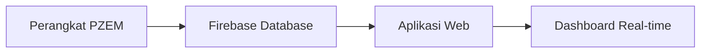

Selamat datang di **Electric Monitoring System** - platform dasbor komprehensif yang dirancang untuk memantau sistem kelistrikan secara real-time. Sistem ini dikembangkan sebagai proyek PKA oleh **Riswandi, S.T., M.Sos** dan dapat diakses melalui [iot-siaga.rri.go.id](http://iot-siaga.rri.go.id).

repository github dapat di akses pada link berikut https://github.com/alsyauqi/Electric-Monitoring

## Gambaran Umum

Electric Monitoring System adalah solusi canggih untuk pemantauan dan analisis mendalam kualitas daya, efisiensi, dan performa sistem kelistrikan untuk aplikasi industri. Platform ini menggabungkan teknologi IoT dengan visualisasi data yang intuitif untuk memberikan wawasan real-time tentang kondisi sistem kelistrikan.

## Arsitektur Sistem

Sistem ini memiliki arsitektur data yang solid dengan alur: **Perangkat PZEM** → **Firebase (Database Real-time)** → **Aplikasi Web**

## Fitur Utama

### 🔍 **Pemantauan Real-time**

- Monitoring tegangan, arus, dan daya secara langsung
- Update data setiap 5 detik dari sensor PZEM
- Visualisasi interaktif dengan grafik yang responsif

### ⚡ **Indikator Kinerja Utama (KPI)**

- **Tegangan Rata-rata**: Status normal 210-230V
- **Arus Rata-rata**: Tracking tren perubahan
- **Power Factor**: Rating Excellent (\>0.95), Good (\>0.90), Poor (\<0.90)

### 🎛️ **Threshold dan Klasifikasi**

#### Status Tegangan

- **Normal**: 210V - 230V
- **Warning**: 200V - 240V
- **Error**: \< 200V atau \> 240V

#### Klasifikasi Power Factor

- **Excellent**: ≥ 0.95
- **Good**: ≥ 0.90
- **Fair**: ≥ 0.80
- **Poor**: \< 0.80

#### Status Beban

- **Optimal**: \< 70%
- **Normal**: \< 85%
- **High**: ≥ 85%

## Teknologi yang Digunakan

- **Frontend**: Next.js, React, TypeScript
- **Database**: Firebase Realtime Database
- **Hardware**: Sensor PZEM untuk monitoring 3-phase
- **Visualisasi**: Recharts untuk grafik interaktif
- **Storage**: Firebase data cache

## Keunggulan Sistem

✅ **Real-time Monitoring** dengan update 5 detik\
✅ **Interface Intuitif** dengan visualisasi modern\
✅ **Responsive Design** untuk semua perangkat

## Target Pengguna

- **Engineer Listrik** - Monitoring dan analisis sistem
- **Facility Manager** - Optimasi efisiensi energi
- **Maintenance Team** - Deteksi dini masalah
- **Management** - Laporan performa dan KPI

---